# 🛡️ Solar Shield — Sistema de Monitoramento de Clima Espacial

Plataforma de microsserviços que ingere dados reais da NASA (DONKI), classifica riscos de clima espacial e dispara alertas para operadores de infraestrutura crítica.
Stack: Java 17 · Spring Boot 3.2 · RabbitMQ 3.13 · Redis 7.2 · Nginx 1.25 · Docker Compose
---
### Arquitetura
#### C4 — Nível 1: System Context
Objetivo: mostrar quem usa o sistema e com quais sistemas externos ele se comunica.
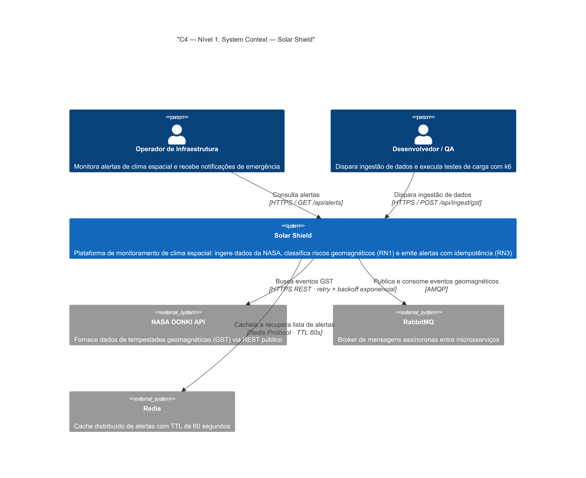

---
C4 — Nível 2: Container
Objetivo: detalhar os contêineres de software que compõem o sistema e suas responsabilidades.


---
C4 — Nível 3: Component — Ingest Service
Objetivo: detalhar os componentes internos do Ingest Service, organizados por camada arquitetural.
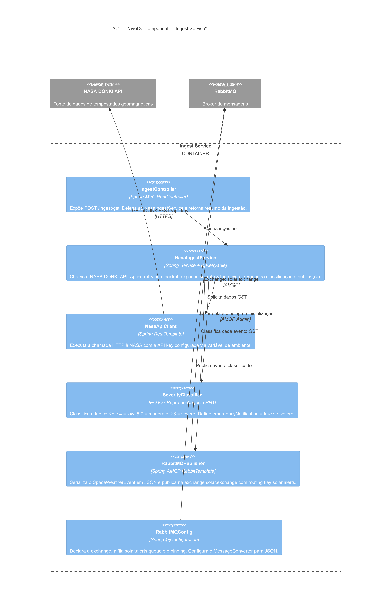

---
C4 — Nível 3: Component — Alert Service
Objetivo: detalhar os componentes internos do Alert Service, organizados por camada arquitetural.
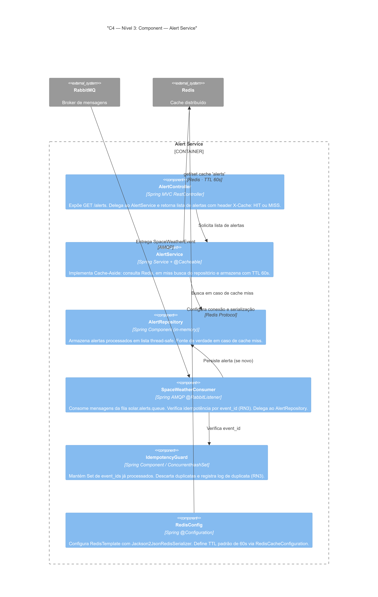

---

## Justificativa do TTL do Cache Redis

> **TTL: 60 segundos** — Pense no cache como um **mural de avisos** no corredor de uma usina: em vez de cada operador correr até a sala de controle buscar a lista de alertas a cada vez, eles leem o mural. O `@CacheEvict` é o responsável por arrancar o mural antigo e colar um novo sempre que um alerta novo chega pelo RabbitMQ. Mas e se o responsável pelo mural falhar e esquecer de atualizar? O TTL é o **prazo de validade impresso no rodapé do mural** — após 60 segundos ele se autodestrói, forçando a próxima leitura a buscar os dados frescos e colar um mural novo. Esse prazo é definido em `RedisConfig.java`:
> ```java
> private static final Duration CACHE_TTL = Duration.ofSeconds(60);
> ```
> O valor de 60s é curto o suficiente para garantir consistência eventual aceitável em monitoramento de clima espacial, e longo o suficiente para absorver rajadas de múltiplos operadores lendo simultaneamente sem sobrecarregar o repositório em memória.

---

## Regras de Negócio

### RN1 — Severidade de Tempestade Geomagnética

A classificação é feita com base no índice Kp de cada evento GST retornado pela NASA DONKI:

| Índice Kp | Severidade | `emergencyNotification` |
|---|---|---|
| Kp ≤ 4 | `low` | `false` |
| 5 ≤ Kp ≤ 7 | `moderate` | `false` |
| Kp ≥ 8 | `severe` | `true` |

### RN3 — Idempotência

Eventos com o mesmo `event_id` recebidos mais de uma vez são descartados pelo `AlertRepository` via `ConcurrentHashMap.putIfAbsent()`. Uma linha de log no nível `WARN` é registrada a cada duplicata detectada:

```
WARN  [RN3] Duplicata ignorada | eventId=GST-2024-001
```

---

## Resiliência — Retry com Backoff Exponencial

A chamada à NASA DONKI no `NasaIngestService` usa `@Retryable` com backoff exponencial. Caso a API esteja indisponível, o serviço tenta novamente de forma progressiva antes de desistir:

| Tentativa | Espera antes de tentar novamente |
|---|---|
| 1ª | imediata |
| 2ª | 1 segundo |
| 3ª | 2 segundos |
| máximo por tentativa | 10 segundos |

Após a 3ª tentativa sem sucesso, o método `@Recover` é acionado e retorna uma lista vazia, evitando que o serviço quebre.

---

## Pré-requisitos

- Docker 24+ e Docker Compose v2
- Java 17+ e Maven 3.9+ — apenas para rodar os testes fora do Docker
- k6 — apenas para o smoke test ([instruções de instalação](https://grafana.com/docs/k6/latest/set-up/install-k6/))
- Chave da NASA API — obtenha gratuitamente em [api.nasa.gov](https://api.nasa.gov)
  > A chave `DEMO_KEY`, com limite de 30 req/hora

---

## Instruções de Execução
### 1. Clonar o repositório
```bash
git clone https://github.com/SEU_USUARIO/solar-shield-microsservices.git
cd solar-shield-microsservices
```
### 2. Configurar a NASA API Key
   Edite o arquivo `.env` na raiz do projeto:
```env
NASA_API_KEY=SUA_CHAVE_AQUI
```
### 3. Subir toda a infraestrutura
```bash
docker-compose up --build
```
Aguarde todos os serviços ficarem saudáveis (cerca de 2–3 minutos no primeiro build). Você verá nos logs:
```
solar-ingest  | Started IngestServiceApplication
solar-alert   | Started AlertServiceApplication
solar-nginx   | nginx: worker process started
```
### 4. Verificar os serviços
Após o `docker-compose up --build`, confirme que todos os serviços estão saudáveis:

| Serviço | URL | Descrição |
|---|---|---|
| API Gateway | http://localhost:8080/health | Health check do Nginx |
| Ingest Service | http://localhost:8081/ingest/health | Health check direto |
| Alert Service | http://localhost:8082/alerts/health | Health check direto |
| RabbitMQ Management | http://localhost:15672 | Login: `guest` / `guest` |

### 5. Disparar a ingestão de dados da NASA
```bash
curl -X POST http://localhost:8080/api/ingest/gst
```
Resposta esperada:
```json
{
  "message": "Ingestão concluída com sucesso.",
  "published": 3
}
```
### 6. Consultar os alertas (valida cache hit/miss)
```bash
# 1ª chamada → CACHE MISS (busca da memória, grava no Redis)
curl http://localhost:8080/api/alerts

# 2ª chamada dentro de 60s → CACHE HIT (retorna do Redis)
curl http://localhost:8080/api/alerts
```
Observe nos logs do `solar-alert`: `[CACHE MISS]` aparece apenas na 1ª chamada. 

**Imagem do que deverá aparecer:**
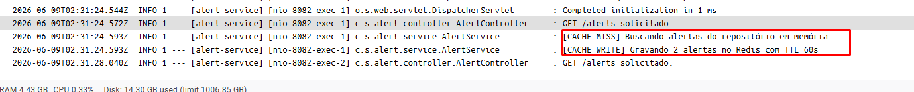

### 7. Executar os testes unitários
   RN1 — Severidade (ingest-service):
```bash
cd ingest-service
mvn test
```
RN3 — Idempotência (alert-service):
```bash
cd alert-service
mvn test
```
### 8. Executar o smoke test k6

> **Antes de rodar:** certifique-se de que o `docker-compose up` está ativo na porta 8080.

#### Opção A — Via Docker (recomendado, sem instalar nada)

Execute a partir da **raiz do projeto**. O k6 roda dentro da rede Docker e acessa o Nginx pelo nome interno do container:

**Windows (PowerShell):**
```powershell
docker run --rm -i `
  --network solar-shield-microsservices_default `
  -v ${PWD}/k6:/scripts `
  grafana/k6 run /scripts/smoke-test.js `
  -e BASE_URL=http://nginx:80
```

**Linux / macOS:**
```bash
docker run --rm -i \
  --network solar-shield-microsservices_default \
  -v $(pwd)/k6:/scripts \
  grafana/k6 run /scripts/smoke-test.js \
  -e BASE_URL=http://nginx:80
```

> O nome da rede (`solar-shield-microsservices_default`) é criado automaticamente pelo Docker Compose com base no nome da pasta. Se der erro de rede, confirme com:
> ```bash
> docker network ls
> ```
> E substitua pelo nome correto listado.

---

#### Opção B — Instalando o k6 localmente no Windows

**Passo 1** — Baixe o instalador MSI direto (não precisa do Chocolatey):
👉 https://dl.k6.io/msi/k6-latest-amd64.msi

**Passo 2** — Execute o `.msi` baixado (next → next → finish)

**Passo 3** — Feche **todos** os PowerShells abertos e abra um novo

**Passo 4** — Confirme a instalação:
```powershell
k6 version
```

**Passo 5** — Volte à raiz do projeto e execute:
```powershell
k6 run k6/smoke-test.js
```

---

#### Resultado obtido (execução real)

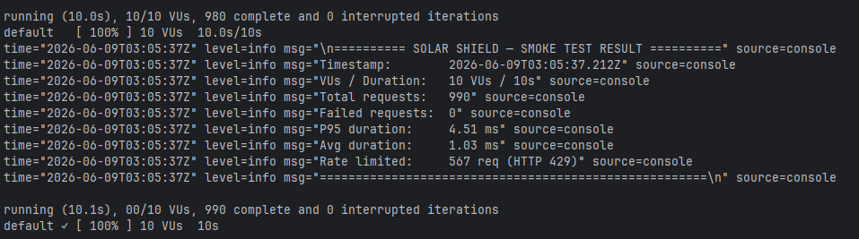

> **567 requisições com HTTP 429** é o comportamento **correto e esperado** — significa que o rate limiting do Nginx está ativo. O k6 trata 429 como sucesso nos checks (veja `smoke-test.js`).

---

#### Salvar o resultado automaticamente

O `handleSummary` no `smoke-test.js` grava o resultado em `k6/results.json` ao final do teste. Se aparecer erro de arquivo não encontrado, crie o arquivo antes de rodar:

**Windows (PowerShell):**
```powershell
New-Item -Path k6\results.json -ItemType File -Force
```

**Linux / macOS:**
```bash
touch k6/results.json
```

Depois rode o comando da Opção A normalmente — o arquivo será sobrescrito com os dados reais.

> Resultado esperado: 10 VUs durante 10 segundos, P95 < 500ms, taxa de erro < 5%.

---

### 9. Verificar idempotência (RN3)

Dispare a ingestão duas vezes seguidas:

```bash
curl -X POST http://localhost:8080/api/ingest/gst
curl -X POST http://localhost:8080/api/ingest/gst
```

Verifique os logs — na segunda execução você verá:

```
[RN3] Duplicata ignorada | eventId=GST-2024-...
[CONSUMER] Mensagem descartada (duplicata RN3) | eventId=GST-2024-...
```

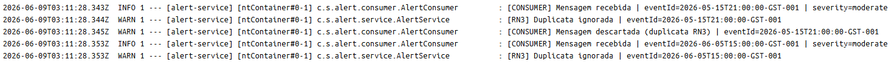

A contagem de alertas permanece a mesma:

```bash
curl http://localhost:8080/api/alerts/count
```

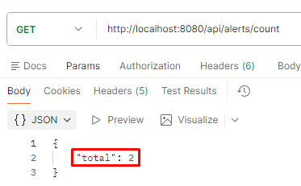

---

### 10. Verificar rate limiting do Nginx

O Nginx está configurado com `rate=3r/s` e `burst=2` na rota `/api/ingest/gst`, permitindo no máximo **5 requisições** antes de bloquear. Para forçar o HTTP 429, dispare as requisições **em paralelo**.

> **Por que não funciona no PowerShell?**
> O `Start-Job` do PowerShell cria processos filhos isolados — cada job tem seu próprio contexto de rede e inicialização, o que adiciona latência entre as requisições. Na prática elas chegam espaçadas ao Nginx, dentro do limite de 3 req/s, e todas retornam 200. O Git Bash usa `&` (subshell leve), que dispara os processos quase simultaneamente, saturando o rate limit.

> **Pré-requisito:** use o **Git Bash** (não o PowerShell nem o CMD). O Git Bash já vem instalado junto com o Git for Windows.

> **Importante:** o loop sequencial sem `&` também não funciona — as 10 requisições levam mais de 3s e todas passam dentro do limite. O `&` é obrigatório para disparar tudo simultaneamente.

#### Executar no Git Bash

```bash
rm -f /tmp/rl_*.txt
for i in {1..10}; do
  ( curl -s -o /dev/null -w "%{http_code}" -X POST http://localhost:8080/api/ingest/gst > /tmp/rl_$i.txt ) &
done
wait
echo "=== Resultado do Rate Limiting ==="
for i in {1..10}; do
  echo "  req $i  → $(cat /tmp/rl_$i.txt)"
done
echo "=================================="
rm -f /tmp/rl_*.txt
```

#### Resultado obtido (execução real)

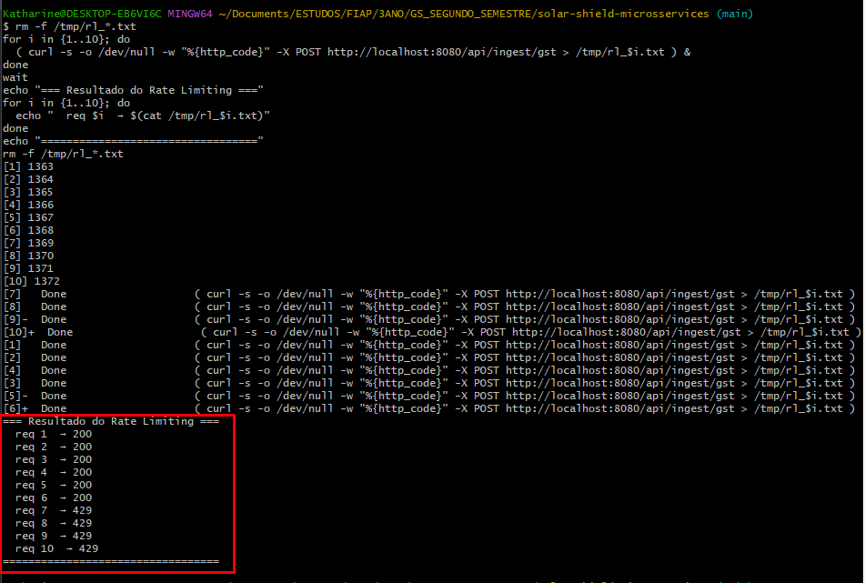

> **6 × 200** passaram dentro do limite — **4 × 429** bloqueadas pelo Nginx.
> O rate limiting está ativo e funcionando conforme esperado (`rate=3r/s`, `burst=2`).

---
## Endpoints

### Via Nginx — porta 8080
> Use estes endpoints no roteiro de avaliação.

| Método | URL | Descrição |
|---|---|---|
| `POST` | `http://localhost:8080/api/ingest/gst` | Dispara ingestão de eventos GST da NASA |
| `GET` | `http://localhost:8080/api/alerts` | Lista alertas (Cache-Aside Redis, TTL 60s) |
| `GET` | `http://localhost:8080/health` | Health check do gateway Nginx |

---

### Diretos — para debug

| Serviço | URL | Descrição |
|---|---|---|
| ingest-service | `http://localhost:8081/ingest/health` | Health check |
| alert-service | `http://localhost:8082/alerts/health` | Health check |
| alert-service | `http://localhost:8082/alerts/count` | Contagem de alertas persistidos |
| RabbitMQ UI | `http://localhost:15672` | Login: `guest` / `guest` |
---
Estrutura do Repositório
```
solar-shield-microsservices/
├── docker-compose.yml
├── .env                              ← NASA_API_KEY (não commitar com chave real)
├── nginx/
│   └── nginx.conf                    ← Proxy reverso + rate limiting
├── ingest-service/
│   ├── Dockerfile
│   ├── pom.xml
│   └── src/
│       ├── main/java/com/solarshield/ingest/
│       │   ├── IngestServiceApplication.java
│       │   ├── config/               ← RabbitMQConfig, AppConfig
│       │   ├── controller/           ← IngestController (POST /ingest/gst)
│       │   ├── producer/             ← AlertProducer
│       │   ├── model/                ← GeoStormEvent, AlertMessage
│       │   └── service/              ← NasaIngestService (RN1 + retry)
│       └── test/java/com/solarshield/ingest/
│           └── SeverityClassificationTest.java   ← Testes RN1
├── alert-service/
│   ├── Dockerfile
│   ├── pom.xml
│   └── src/
│       ├── main/java/com/solarshield/alert/
│       │   ├── AlertServiceApplication.java
│       │   ├── config/               ← RabbitMQConfig, RedisConfig
│       │   ├── controller/           ← AlertController (GET /alerts)
│       │   ├── consumer/             ← AlertConsumer
│       │   ├── model/                ← Alert, AlertMessage
│       │   ├── repository/           ← AlertRepository (ConcurrentHashMap)
│       │   └── service/              ← AlertService (RN3 + @Cacheable)
│       └── test/java/com/solarshield/alert/
│           └── IdempotencyTest.java              ← Testes RN3
├── k6/
│   ├── smoke-test.js                 ← 10 VUs / 10s
│   └── results.json                  ← Resultado da última execução
└── tests/
```
---
Parar os serviços
```bash
docker-compose down

# Para remover também os volumes (limpa filas RabbitMQ e cache Redis):
docker-compose down -v
```
---
## Referência Rápida — Elementos C4 usados

| Símbolo | Significado |
|---|---|
| `Person` | Ator humano que interage com o sistema |
| `System` / `System_Ext` | Sistema interno / externo ao escopo |
| `Container` / `ContainerDb` | Unidade executável / banco de dados dentro do sistema |
| `Component` | Componente interno de um container (classe, módulo) |
| `System_Boundary` / `Container_Boundary` | Fronteira visual (sistema ou container) |
| `Rel` | Dependência ou chamada entre elementos |
| `_Ext` (sufixo) | Elemento fora da fronteira do sistema sob análise |
---
## Evidências de Funcionamento

No decorrer do arquivo foram adicionadas algumas, mas para fins de organização adicionamos essa seção.

### 1. GET /api/alerts — Cache MISS (1ª chamada)
   Na primeira chamada após a ingestão, a resposta vem do repositório em memória.
```
GET http://localhost:8080/api/alerts
→ 200 OK · 157 ms
```

Resposta retornada:
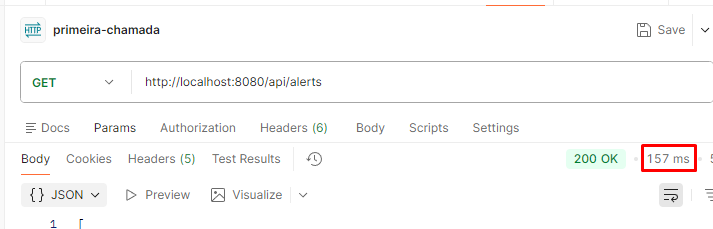
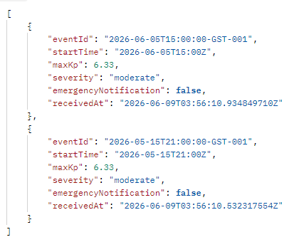

> Kp = 6.33 → **RN1 aplicada corretamente**: severidade `moderate`, `emergencyNotification: false`.
---
### 2. GET /api/alerts — Cache HIT (2ª chamada)
   A segunda chamada dentro de 60 segundos retorna do Redis (32 ms — ~10× mais rápida).
```
GET http://localhost:8080/api/alerts
→ 200 OK · 24 ms   ← dado veio do Redis, não do repositório
```

Resposta retornada:
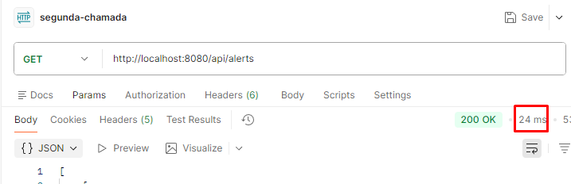


> A queda de ms comprova o cache Redis funcionando.
---
### 3. Como confirmar o cache nos logs do Docker
   Execute após as chamadas:
```bash
docker logs solar-alert
```
Você verá a sequência exata:
#### 1ª chamada — dados buscados na memória e GRAVADOS no Redis
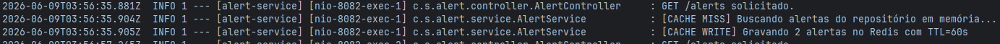

#### 2ª chamada — Spring intercepta antes do método; nenhuma dessas linhas aparece
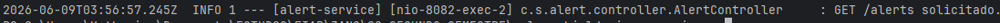

>Só essa linha — o resto veio do Redis sem passar pelo método

> **Regra prática:** se `[CACHE MISS]` e `[CACHE WRITE]` **não aparecem** numa chamada,
> os dados vieram do Redis (HIT). Confirmado na imagem 3 acima:
> entre `03:24:50` e `03:24:58` há dois `GET /alerts solicitado.`, mas só
> o primeiro dispara o `[CACHE MISS]`.
---
#### 4. Novo alerta → cache invalidado automaticamente
   Quando um novo evento chega pelo RabbitMQ, o cache é invalidado:
```bash
# Dispara nova ingestão
curl -X POST http://localhost:8080/api/ingest/gst
```
Log gerado:
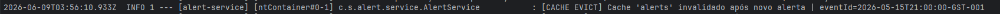


A próxima chamada a `GET /api/alerts` vai gerar um novo `[CACHE MISS]` + `[CACHE WRITE]`,
garantindo que os dados estejam sempre atualizados.
---
5. Verificar idempotência (RN3) nos logs
```bash
# Dispare duas vezes
curl -X POST http://localhost:8080/api/ingest/gst
curl -X POST http://localhost:8080/api/ingest/gst

# Filtre os logs de duplicata (PowerShell)
docker logs solar-alert | Select-String -Pattern "DUPLICATA|RN3"
```
Resultado esperado:
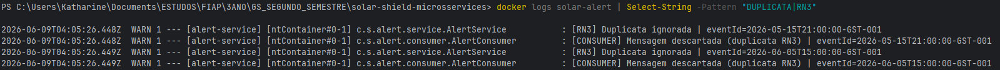
